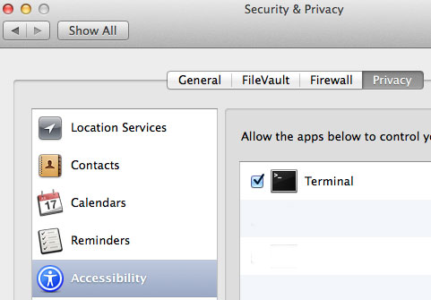

#### flaky [](http://rubygems.org/gems/flaky) [](https://gemnasium.com/appium/flaky)

Run Appium iOS tests to measure flakiness.

- `gem uninstall -aIx flaky; gem install --no-rdoc --no-ri flaky`
- `flake 3 ios[nop]` - Run the iOS test named nop 3 times.
- `flake 3 ios` - Run all the iOS tests up to 3 times.
If a test passes then it moves onto the next test.
If a test fails 3 times then it moves onto the next test.

The `flake` command must be run in the directory that contains the `Rakefile`.

Results are stored in `/tmp/flaky`

Must set `ENV['APPIUM_HOME']` to point to the appium folder containing `server.js`.

This only works with:

- [Ruby / appium_lib iOS](https://github.com/appium/ruby_lib_ios)
- iOS iPhone Simulator 6.1
- Unique test names per platform

#### Security dialogs

Instruments prompts for security authorization when testing on iOS.
Set the following environment variables in `~/.bash_profile`.
If you don't know your username, type `whoami` in the Terminal and use that value.

```
export FLAKY_USER="username"
export FLAKY_PASSWORD="password"
```

Ensure that Terminal has been granted permission to control the computer. This is set in Security & Privacy -> Accessibility.



Run `flake auth` to automatically dismiss security dialogs.

--

#### For each test:

- iOS Simulator is closed
- All `/Users/#{user}/Library/Application Support/iPhone Simulator/**/Applications/*` are removed
- Appium server is restarted
- [spec](https://github.com/bootstraponline/spec) test logs are saved and colored
- [Appium](https://github.com/appium/appium) logs are saved and colored

--

#### logs & video

```ruby
  # Sample setup/teardown that saves logs and records videos.
  # Appium::Driver.new(app_path: env_app_path, debug: true,
  #                   device: device, device_cap: device_cap,
  #                   export_session: true).start_driver
  #
  # The following code goes after Driver.new.start_driver


  puts "Recording #{device} to /tmp/video.mov"
  flaky_screen_recording_pid = Flaky.screen_recording_start os: device, path: '/tmp/video.mov'

  Minitest.after_run do
    if $driver
      puts "Ending pid: #{flaky_screen_recording_pid}"
      Flaky.screen_recording_stop flaky_screen_recording_pid # save video
      ignore { wait(10) { $driver.x } }
    end
  end
```

